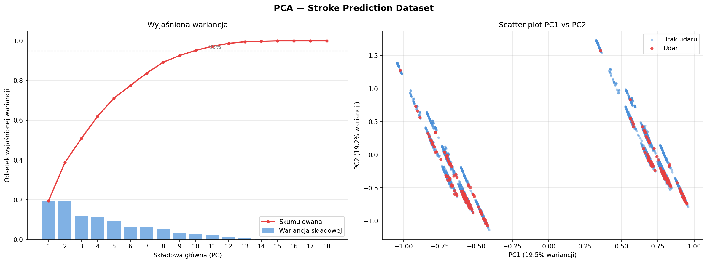

# Stroke-Prediction-WSI-Project
Projekt z przedmiotu "Wprowadzenie do sztucznej inteligencji". Repozytorium zawiera skrypty wstępnego przetwarzania danych.

## Struktura projektu

| Plik / folder | Opis |
|---|---|
| `data_report.py` | Eksploracyjna analiza surowego datasetu — wypisuje liczebność rekordów, typy kolumn, brakujące wartości, rozkłady zmiennych kategorycznych i statystyki numeryczne. |
| `preprocessing_PCA.py` | Preprocessing pod PCA: imputacja BMI medianą, normalizacja wieku, label encoding, one-hot encoding, standaryzacja, a następnie PCA z wizualizacją wyjaśnionej wariancji i scatter plotem PC1 vs PC2. |
| `preprocessing_RF.py` | Preprocessing pod Random Forest: analogiczny pipeline bez standaryzacji (RF nie wymaga skalowania). Zapisuje gotowy dataset do CSV. |
| `pca_visualization.png` | Wygenerowany wykres PCA (wyjaśniona wariancja + scatter plot PC1 vs PC2). |
| `dataset/dataset.csv` | Surowy dataset (Stroke Prediction Dataset, ~5 000 rekordów). |
| `dataset/dataset_prep_PCA.csv` | Dataset po preprocessingu przygotowanym pod PCA. |
| `dataset/dataset_prep_RF.csv` | Dataset po preprocessingu przygotowanym pod Random Forest. |

## Wizualizacja PCA

